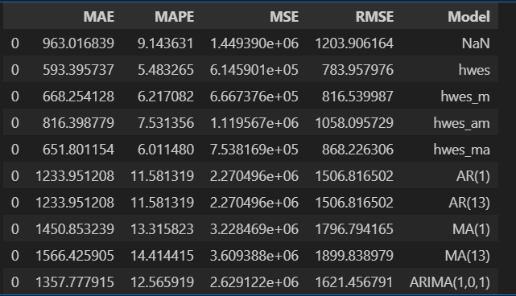

# Electricity demand prediction using timeseries analysis
This project is aimed at predicting electricity consumption demand in TGNPDCL region. TGNPDCL (Telangana State Northern Power Distribution Company Limited) is one of the two electricity distribution companies in the state of Telangana, India. It is responsible for supplying and distributing electricity to 17 districts in the northern part of the state. Monthly electricity consumption data in TGNPDCL has been used for predictions.
## Table of Contents
* Description
* Data
* Methodology
* Evaluation
* Results
* Deployment
* Future Work

## Data
The electricity consumption data has been sourced from data.telangana.gov.in

* electricity consumption data for each month staring from january 2019 to may 2024 is downloaded into separate excel files.
* the data in excel files have been preprocessed to 4,80,000 rows and 3 columns

##  Methodology
* EDA(cyclicity, stationarity) is performed to understand more about data
* split data into train and test sets
* Built timeseries models staring from moving average, simple exponenial moving average, Holt-Winters’ Exponential Smoothing, AR mode, MA, ARIMA, ARIMA grid search.

## Evaluation
Metrics like MAE, MAPE, MSE, RMSE are used to evaluate models

## Result
Holt-Winters’ Exponential Smoothing ( multiplicate variant) emerged as best model with MAPE of 5%. 
## Deployment
This project has been deployed using streamlit. 
Access this at https://tsnpdcl.streamlit.app/
## Future work
More granular predictions can be obtained...